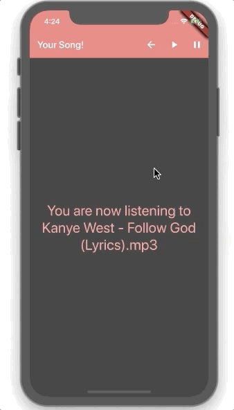

<p align="center">
  
</p>

# Gif_Flow 

Welcome to Gif_Flow a mobile app that allows users to take a survey where all of the answers are gifs. At the end our app will recommend a song for the user to listen to. A user can freely pause and play the song or take the survey again.  

## Our App

|     Taking the Survey              |     Listening to your song       
| ------------------------- | ------------------------- |
| | |

## Getting Started

Fork and clone this repo.

To make sure packages are installed run:

```
flutter install
```

If this is your first Flutter project please see the resources below:

- [Lab: Write your first Flutter app](https://flutter.dev/docs/get-started/codelab)
- [Cookbook: Useful Flutter samples](https://flutter.dev/docs/cookbook)

For help getting started with Flutter, view our
[online documentation](https://flutter.dev/docs), which offers tutorials,
samples, guidance on mobile development, and a full API reference.
